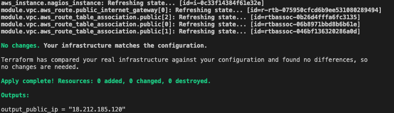
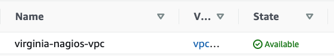
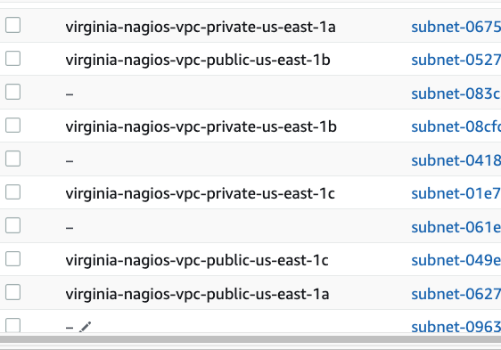
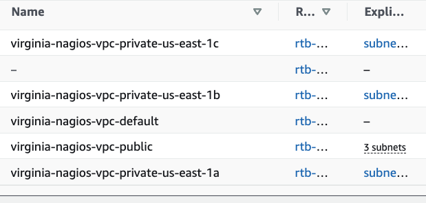
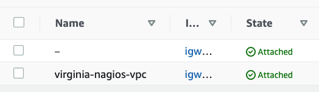
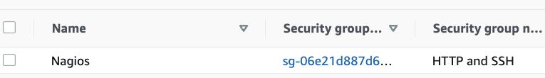
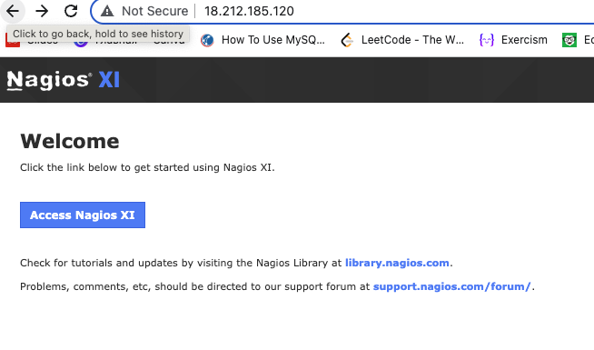
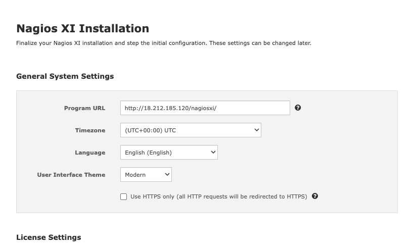
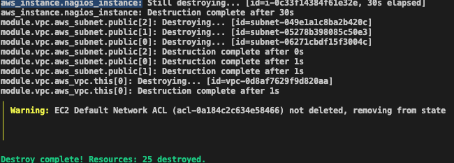

# Deploy Nagios WebServer on AWS EC2 instance using Terrafom VPC module, Makefile

For this project I used the:
- main.tf
- provider.tf
- tags.tf
- output.tf
- Makefile
- regions tf.vars

Terraform is a provisioning tool that makes infrastructure provisioning and management easier, safe and efficient. It ensures reliability, speed and less error-prone process.
Some Benefits of Terraform:

1. Deploy infrastructure to multiple clouds (AWS, GCP, AZURE, etc)

2. Preview infrastructure changes before applying or building them.

3. Speed and safety: Automation is faster and more consistent, repeatable, and less error-prone compared to manual configuration.

I will build a nagios webserver jusing terraform.


PREREQUISITES

In order to successfully carry out the steps in this article, you will need:

1. Ubuntu/CentOs

2. AWS account

OBJECTIVES

1. Terraform installation and configuration

2. Building a webserver (with VPC, Subnet, Internet Gateway, Route Table)

TERRAFORM INSTALLATION

Step 1: download terraform from https://www.terraform.io/downloads.html (i downloaded the version for linux)

```
wget https://releases.hashicorp.com/terraform/1.4.6/terraform_1.4.6_darwin_amd64.zip
unzip terraform_1.4.6_darwin_amd64.zip
sudo mv terraform /usr/local/bin

You can check the version of terraform:
terraform -version
```

main.tf contains the script to create webserver (vpc, subnets,ec2 instance):
```
module "vpc" {
  source             = "terraform-aws-modules/vpc/aws"
  name               = var.vpc_name
  cidr               = var.cidr_block
  azs                = ["${var.region}a", "${var.region}b", "${var.region}c"]
  private_subnets    = var.private_subnets
  public_subnets     = var.public_subnets
  enable_nat_gateway = false
  enable_vpn_gateway = false
}

resource "aws_security_group" "nagios" {
  name   = "HTTP and SSH"
  vpc_id = module.vpc.vpc_id
  ingress {
    from_port   = 80
    to_port     = 80
    protocol    = "tcp"
    cidr_blocks = ["0.0.0.0/0"]
  }
  ingress {
    from_port   = 22
    to_port     = 22
    protocol    = "tcp"
    cidr_blocks = ["0.0.0.0/0"]
  }
  egress {
    from_port   = 0
    to_port     = 0
    protocol    = -1
    cidr_blocks = ["0.0.0.0/0"]
  }
  tags = local.common_tags
}
resource "aws_key_pair" "nagios" {
  key_name   = var.key_name
  public_key = file(var.key_file)
  tags       = local.common_tags
}
# Create AWS EC2 instance
resource "aws_instance" "nagios_instance" {
  ami           = var.ami_id
  instance_type = var.instance_type
  key_name      = var.key_name
  subnet_id     = element(module.vpc.public_subnets, 0)
  #aws_subnet.public_subnets.id
  #vpc_security_group_ids      = [aws_security_group.nagios.id]
  associate_public_ip_address = true
  user_data                   = file("centosScript.sh")
  tags                        = local.common_tags
}
```

Content of provider.tf:
```
provider "aws" {
  region = var.region
}
```

variables.tf:
```
variable "region" {
  type        = string
  description = "Enter AWS region"
  default     = ""
}
variable "vpc_name" {
  type        = string
  description = "Enter the name of VPC"
  default     = ""
}
variable "cidr_block" {
  description = "Enter cidr block"
  type        = string
  default     = ""
}
variable "public_subnets" {
  description = "Enter private subnets"
  type        = list(any)
  default     = []
}
variable "public_subnet_cidr_block" {
  description = "Enter the public subnet cidr_block"
  type        = string
  default     = "10.0.1.0/24"
}
variable "public_subnet_az" {
  description = "Enter the AZ"
  type        = list(any)
  default     = []
}
variable "private_subnets" {
  description = "Enter private subnet"
  type        = list(any)
  default     = []
}
variable "private_subnet_cidr_block" {
  description = "Enter the private subnet cidr_block"
  type        = string
  default     = "10.0.2.0/24"
}
variable "private_subnet_az" {
  description = "Enter the AZ"
  type        = list(any)
  default     = []
}
variable "key_name" {
  description = "Enter key name"
  type        = string
  default     = ""
}
variable "key_file" {
  description = "Enter public key location"
  type        = string
  default     = "~/.ssh/id_rsa.pub"
}
variable "ami_id" {
  description = "Enter the ami id"
  type        = string
  default     = ""
}
variable "instance_type" {
  description = "Enter the instance type"
  type        = string
  default     = ""
}
```

tags.tf:
```
locals {
  common_tags = {
    Name = "Nagios"
    Team = "DevOps"
    Env  = "Dev"
  }
}
```

output.tf:
```
output "output_public_ip" {
  value = aws_instance.nagios_instance.public_ip
}
```
Which can be used for browsing.

You can see other tfvars and script files in attached files and folders.

Here I using the command:
```
make virginia
```
Created the VPC:





Created 3 public and 3 private subnets:



Created a route table called will route any request to the outside world (“0.0.0.0/0”) through the internet gateway:



Creating an internet gateway called virginia-nagios-vpc and attaching it to the virginia-nagios-vpc (this will allow internet traffic to/from our subnet).



Creating a security group called Nagios which will allow inbound requests to ports 22 and 80 from the outside world.



Creating an instance of type t2.micro with ami_id = "ami-002070d43b0a4f171", attaching the Nagios security group to it and placing this instance in the subnet and giving it a public IP.
Providing this instance with a launch script which will install, start and enable the Apache and Nagios server, and display the Nagios webserver page:





terraform commands:

```
terraform init
make virginia
# Which can install all resources in N.Virginia region
# After successfully creating our resources with terraform, Let destroy the resources created, as we don’t want to incur any charges/fees.
make virginia-destroy
```




